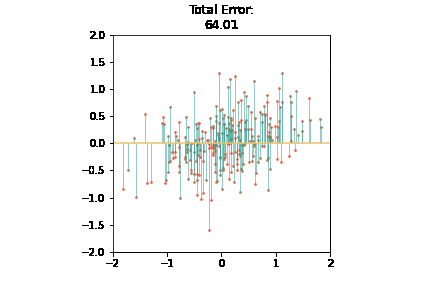

# PCA

## HW Objective
Use diagonalization to get the pinciple axes.
+ For Matlab, you should finish the part in line `25~31`
+ For Python, you should finish the part in line `26~35`

### Submmit Format
+ For Matlab, please submmit:
    + `get_error.m`: Don't need to modify, just submmit.
    + `HW4_{ID}.m`: Finish the `HW4_starter.m` and rename it. (eg. `HW4_110061553.m`)
+ For Python, please submmit:
    + `HW4_{ID}.py`: Finish the `HW4_starter.m` and rename it. (eg. `HW4_110061553.m`)
    + `output_{ID}.gif`: Run the code you will get `output.py`, rename it.

## Demo
After finish your part, continue run the code. You will see how the total error change with different axes.  

## Learn More about PCA
+ [Eigenvectors and eigenvalues | Chapter 14, Essence of linear algebra - YouTube](https://www.youtube.com/watch?v=PFDu9oVAE-g)
+ [LeeMeng - 世上最生動的 PCA：直觀理解並應用主成分分析](https://leemeng.tw/essence-of-principal-component-analysis.html)
